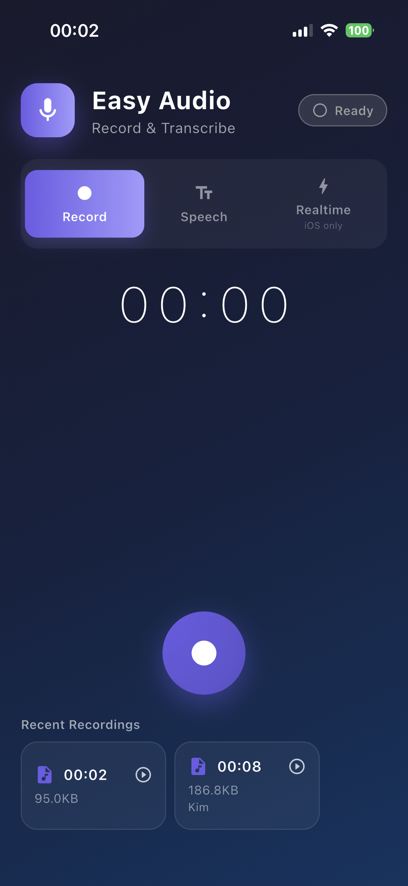
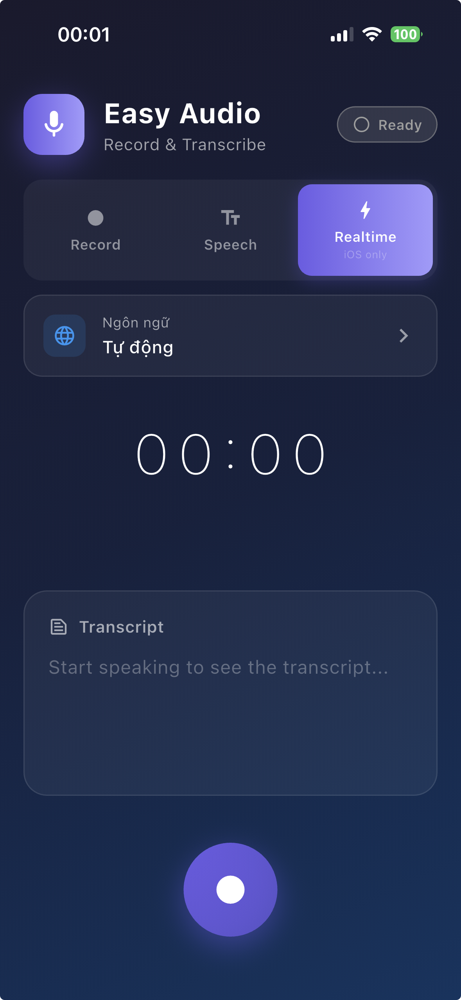
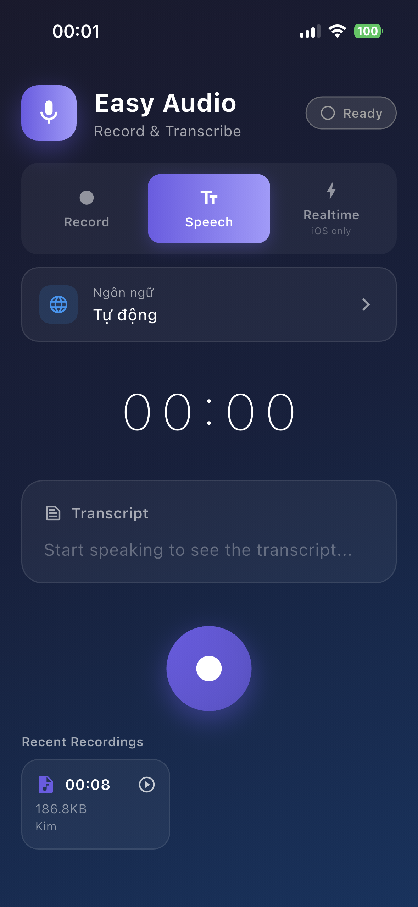
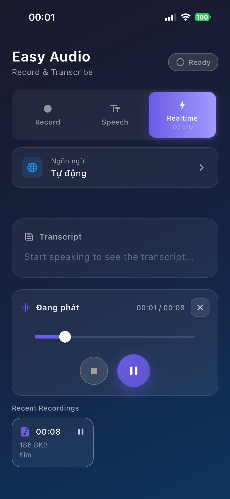
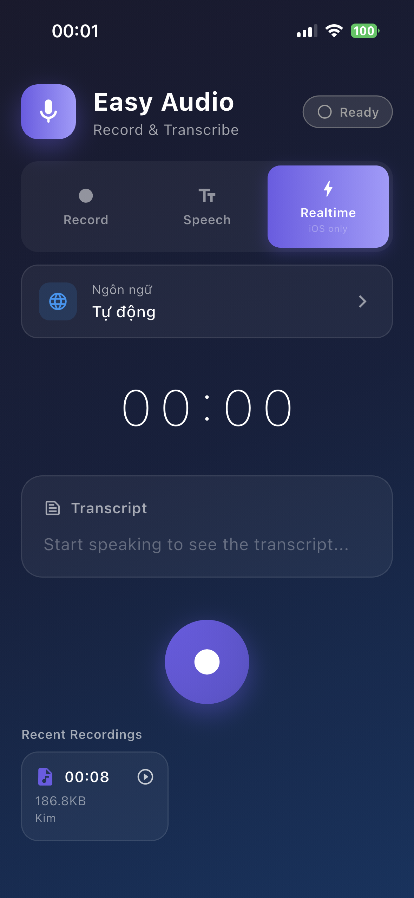

# easy_audio

`easy_audio` is a Flutter package that provides a clean, pragmatic API for:

- Recording audio to a file (built on top of `record`)
- Streaming speech-to-text transcripts (built on top of `speech_to_text`)
- Best-effort realtime mode: record + transcript concurrently
- Crash recovery (recover an in-progress recording after app crash/kill)
- Background recording (Android via Foreground Service; iOS via `UIBackgroundModes`)
- A tiny playback helper (built on top of `just_audio`) to preview recordings in UI

Note: speech-to-text while the app is in background depends on OS/device. The package tries to keep STT running when possible, but it cannot guarantee transcripts will always be available in background.

## Screenshots

<table>
  <tr>
    <td align="center">
      
      <br/>Record
    </td>
    <td align="center">
      
      <br/>Record + STT
    </td>
    <td align="center">
      
      <br/>Speech to text
    </td>
  </tr>
  <tr>
    <td align="center">
      
      <br/>Recording detail
    </td>
    <td align="center">
      
      <br/>Playback + transcript
    </td>
    <td></td>
  </tr>
</table>

## Features

- **Recording**
  - Start / pause / resume / stop / cancel
  - Multiple codecs via `AudioEncoder` (`aacLc`, `wav`, ...)
  - Realtime amplitude stream (`amplitudeStream`) for waveform/visualizer UI
  - Auto stop via `maxDuration`
  - Custom output directory + file naming (`outputDirectory`, `filePrefix`, `fileExtension`)

- **Speech-to-text**
  - Realtime transcript stream (`transcriptStream`) including `isFinal`, `confidence`, `alternatives`
  - List supported locales via `getSupportedLocales()`

- **Crash recovery**
  - Enable via `enableCrashRecovery`
  - Stores recording metadata in cache; on next launch call `recoverLastRecording()` to restore file + buffered transcript

- **Background recording**
  - Android: `enableBackgroundRecording` + `AndroidService` to run a Foreground Service
  - iOS: requires `UIBackgroundModes` (audio)

- **Playback (helper)**
  - `AudioPlaybackManager.instance.playSource()` / `toggleSource()` / `seek()` / `stop()`
  - `snapshot` (`ValueNotifier<AudioPlaybackSnapshot>`) for UI binding (playing/loading/position/duration)

## Public API (overview)

- Service
  - `EasyAudioService` (singleton) implements `EasyAudioServiceInterface`
  - Streams
    - `stateStream: Stream<EasyAudioState>`
    - `transcriptStream: Stream<TranscriptResult>`
    - `amplitudeStream: Stream<double>`
  - Methods
    - `initialize`, `updateConfig`, `requestPermissions`
    - `start`, `pause`, `resume`, `stop`, `cancel`
    - `getSupportedLocales`, `recoverLastRecording`, `dispose`

- Models
  - `RecordingResult` (filePath, duration, transcript, wasRecovered, timestamps, fileSizeBytes, localeId)
  - `TranscriptResult` (text, confidence, isFinal, timestamp, alternatives)
  - `SupportedLocale` (localeId, name)

- Playback
  - `AudioPlaybackManager` + `AudioPlaybackSnapshot`

## Architecture (overview)

The package is organized into a few small modules:

- `lib/src/core/config/`: configuration + enums/state
  - `EasyAudioConfig`, `EasyAudioMode`, `EasyAudioState`

- `lib/src/core/services/`: public-facing services
  - `EasyAudioService`: orchestration (state machine) + streams
  - `EasyAudioServiceInterface`: contract for mocking/testing/injection
  - `AudioPlaybackManager`: shared player for preview playback

- `lib/src/core/utils/`: small helpers used by `EasyAudioService`
  - `PermissionGuards`: pre-start permission/availability checks
  - `RecordConfigFactory`: builds `RecordConfig` (including Android foreground service config)
  - `RecorderStateObserver`: watches interruptions (calls/audio focus) and auto pause/resume (configurable)
  - `SpeechToTextUtils` + `SpeechRecognitionController`: STT initialization and lifecycle control
  - `AmplitudeMonitor`: polls recorder amplitude and normalizes it
  - `EasyAudioPaths` + `EasyAudioCacheInfo`: file paths + crash recovery metadata
  - `WavHeaderRepair`, `FileUtils`

## Installation

Add to `pubspec.yaml`:

```yaml
dependencies:
  easy_audio:
    git:
      url: https://github.com/fighttech-vn/easy_audio
```

## Platform setup

### iOS

In `ios/Runner/Info.plist`:

```xml
<key>NSMicrophoneUsageDescription</key>
<string>This app needs access to the microphone to record audio.</string>

<key>NSSpeechRecognitionUsageDescription</key>
<string>This app needs access to speech recognition for transcription.</string>

<!-- Background recording -->
<key>UIBackgroundModes</key>
<array>
  <string>audio</string>
</array>
```

### Android

In `android/app/src/main/AndroidManifest.xml`:

```xml
<uses-permission android:name="android.permission.RECORD_AUDIO"/>

<!-- Background recording (Foreground Service) -->
<uses-permission android:name="android.permission.FOREGROUND_SERVICE" />
<uses-permission android:name="android.permission.FOREGROUND_SERVICE_MICROPHONE" />

<!-- Android 13+ (optional but recommended for foreground-service notification) -->
<uses-permission android:name="android.permission.POST_NOTIFICATIONS" />

<application>
  <service
    android:name="com.llfbandit.record.service.AudioRecordingService"
    android:foregroundServiceType="microphone"
    android:exported="false" />
</application>
```

Note: On Android 13+ you may need to request runtime permission `POST_NOTIFICATIONS` for the foreground-service notification to appear properly.

## Code examples

### 1) Basic recording

```dart
import 'package:easy_audio/easy_audio.dart';

final audio = EasyAudioService();

await audio.initialize(const EasyAudioConfig(
  mode: EasyAudioMode.recordOnly,
  encoder: AudioEncoder.aacLc,
));

await audio.start();

final result = await audio.stop();
print('File: ${result.filePath}');
print('Duration: ${result.formattedDuration}');
```

### 2) Speech-to-text only

```dart
final audio = EasyAudioService();
await audio.initialize(const EasyAudioConfig(
  mode: EasyAudioMode.speechToTextOnly,
  locale: 'vi-VN',
));

audio.transcriptStream.listen((r) {
  // r.isFinal == true when a phrase is finalized
  print('Transcript: ${r.text}');
});

await audio.start();
```

### 3) Recording + transcript (best-effort)

```dart
final audio = EasyAudioService();
await audio.initialize(const EasyAudioConfig(
  mode: EasyAudioMode.realtime,
  locale: 'vi-VN',
  enableBackgroundRecording: true,
  androidService: AndroidService(
    title: 'Recording in progress',
    content: 'Tap to return to the app',
  ),
));

final subState = audio.stateStream.listen((s) => print('State: $s'));
final subTranscript = audio.transcriptStream.listen((r) => print(r.text));

await audio.start();
final result = await audio.stop();

await subState.cancel();
await subTranscript.cancel();

print('File: ${result.filePath}');
print('Transcript: ${result.transcript}');
```

### 4) Pause/Resume + interruption handling

```dart
await audio.initialize(const EasyAudioConfig(
  pauseOnInterruption: true,
  autoResumeAfterInterruption: false,
));

await audio.start();

// user pause
await audio.pause();

// user resume
await audio.resume();

final result = await audio.stop();
print('wasPausedByInterruption=${audio.wasPausedByInterruption}');
print('duration=${result.duration}');
```

### 5) Crash recovery

```dart
final audio = EasyAudioService();
await audio.initialize(const EasyAudioConfig(enableCrashRecovery: true));

final recovered = await audio.recoverLastRecording();
if (recovered != null) {
  print('Recovered file: ${recovered.filePath}');
  print('Recovered transcript: ${recovered.transcript}');
}
```

### 6) Playback preview (optional)

```dart
final playback = AudioPlaybackManager.instance;

// Bind UI via playback.snapshot (ValueNotifier<AudioPlaybackSnapshot>)
playback.snapshot.addListener(() {
  final snap = playback.snapshot.value;
  print('playing=${snap.isPlaying}, pos=${snap.position}, dur=${snap.duration}');
});

await playback.playSource(result.filePath!);
await playback.seek(const Duration(seconds: 10));
await playback.pause();
await playback.stop();
```

## EasyAudioConfig

| Option | Type | Default | Description |
|---|---:|---:|---|
| `mode` | `EasyAudioMode` | `recordOnly` | Operating mode |
| `encoder` | `AudioEncoder` | `aacLc` | Audio codec |
| `sampleRate` | `int` | `44100` | Sample rate |
| `bitRate` | `int` | `128000` | Bit rate |
| `numChannels` | `int` | `1` | 1=mono, 2=stereo |
| `locale` | `String?` | `null` | STT locale (e.g. `vi-VN`) |
| `maxDuration` | `Duration?` | `null` | Auto-stop after duration |
| `enableCrashRecovery` | `bool` | `true` | Enable crash recovery metadata |
| `pauseOnInterruption` | `bool` | `true` | Auto-pause on system interruption |
| `autoResumeAfterInterruption` | `bool` | `false` | Auto-resume after interruption (use carefully) |
| `enableBackgroundRecording` | `bool` | `false` | Android: enable foreground service |
| `androidService` | `AndroidService?` | `null` | Foreground notification title/content |
| `outputDirectory` | `String?` | `null` | Override recordings directory |
| `filePrefix` | `String` | `easy_audio_` | Prefix for generated file names |
| `fileExtension` | `String?` | `null` | Override file extension (defaults from encoder) |

## Modes

| Mode | Description |
|---|---|
| `recordOnly` | Record audio to a file |
| `speechToTextOnly` | Transcript only (no file) |
| `realtime` | Record + transcript concurrently (best-effort) |

## Run the demo

See `example/README.md`.

## License

MIT
